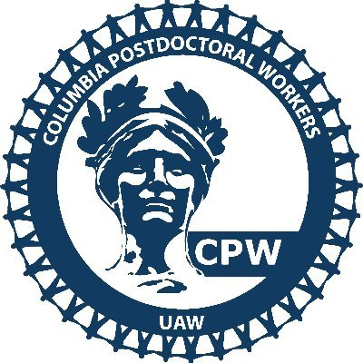

# Welcome! 
### This is Sydney Musick's website for Data Science I: Homework 4

Thank you the TA(s) for grading this and for your hard work this semester!

Here are some helpful links regarding the Columbia graduate student worker strikes:

[Important docs from the organizers](https://docs.google.com/document/d/14O5UUuwV-u5zDn477KjihOdn7vAGc1TdiwP6L982L4o/edit)

[Bargaining framework](https://www.studentworkersofcolumbia.com/bargaining-framework)

[Recent provost update](https://provost.columbia.edu/news/update-student-workers-columbia-uaw-negotiations)

